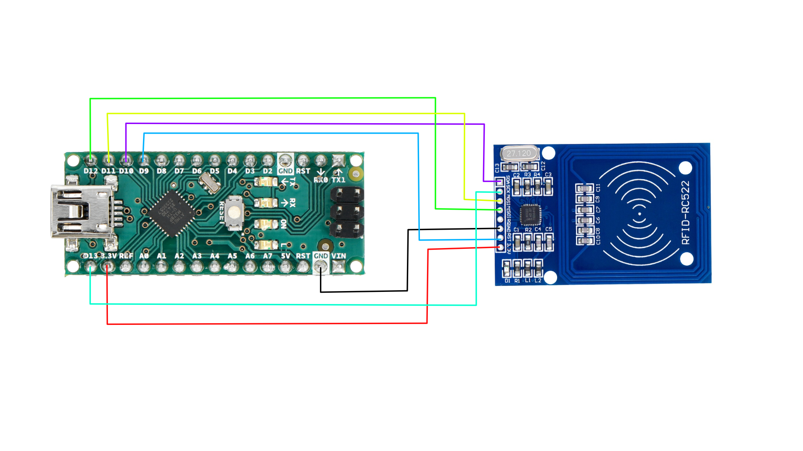
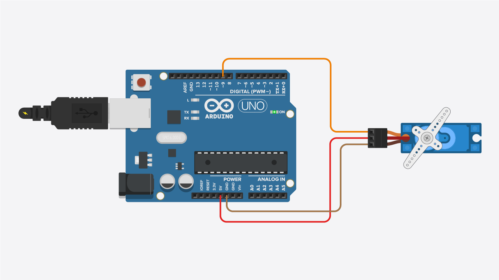

## Inleiding
Rfid tags, een interessante technologie waarmee onze studentenkaarten werken. Ook de kluisjes in het A gebouw en verschillende deursloten werken hiermee. Het is een nuttige en ruim toepasbare tool. In dit project proberen we onder andere de volgende vragen te beantwoorden: Hoe werkt deze technologie precies? Is dit een complexe theorie? En kunnen we dit zelf toepassen? Aan de hand van deze technologie (servo, rfid tag en lezer) werken we zelf een kluisje uit.

## Rfid 

Hiervoor wordt de schakeling zoals hierboven gebruikt.
Allereerst werd de library dump info gebruikt. Uit deze library kan alle informatie gehaald worden die een kaart bevat. En is nodig om een kaart als correct te definiëren. 

## Deel servomotor 

De servomotor werd aangesloten zoals op bovenstaande afbeelding. Met behulp van de servo library kan eenvoudig de hoek worden ingesteld. Deze moet kunnen veranderen om het kluisje te kunnen ontgrendelen en vergrendelen.

## Samenvoegen
Hiervoor worden bovenstaande schemas's gecombineerd. Het enige verschil is dat nu de digitale pin van de servo op 8 ipv 9 is aangesloten
Het systeem wordt zo geprogrammeerd dat bij een foute kaart de motor niet draait. Bij een correcte kaart draait de motor afwisselend open en dicht.

## Reflectie
In dit proces leerden we:
- Hoe een servo motor werkt en hoe te programmeren
- Hoe een rfid lezer en tag werkt en hoe te programmeren
- Hoe we deze componenten kunnen integreren om tot een werkend geheel en kluisje te komen.

Uit dit proces kwamen we volgende moeilijkheden tegen: 

### Uploaden naar arduino
Het uploaden van de code liep lang niet altijd vlot. Bij het gebruik van de arduino nano gaf deze veel foutmeldingen. Na vervolgens over te schakelen op een arduino uno was dit probleem opgelost. 

### Rfid lezer
Zonder library is het gebruik van een rfid lezer heel complex. Zelfs bij het gebruik van een library is het aanpassen van de code heel gevoelig.
